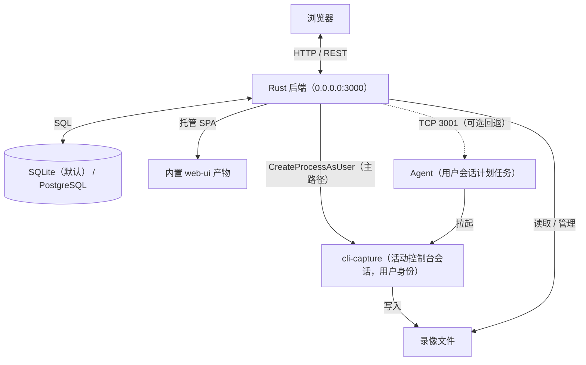

# 技术架构文档：ALLS Recorder

> 面向 **SEGA Amusement Linkage Live System（ALLS）** 的专用软件，目标平台即 ALLS 所基于的 Windows 10 1809；不考虑非 Windows 或非预期 Windows 版本的兼容性，这类 issue 与 PR 不受理。

## 1. 概述

浏览器管理台 → Rust 后端（认证、任务调度、文件与配置管理，并托管前端产物）→ 在**用户会话**里拉起 `cli-capture`（OBS libobs 内核）完成录屏/推流。

后端默认使用内置 SQLite（`<exe_dir>/data/alls_recorder.db`），单机零配置即可跑；也可以通过 `DATABASE_URL` 或在初始化向导里改为 PostgreSQL。

## 2. 技术栈

### 前端（web-ui）

- Vite + React 19 + TypeScript
- 路由 `react-router-dom`，服务端数据用 `@tanstack/react-query`，少量本地状态用 `zustand`
- 样式 TailwindCSS + shadcn 风格工具（`cva` / `clsx` / `tailwind-merge`），图标 `lucide-react`
- HTTP 用 `axios`，后端地址取自 `localStorage.backend_url`（默认 `http://localhost:3000`）

### 后端（server）

- Rust（edition 2021）、Axum 0.7、Tokio
- SQLx 0.7：同一套代码同时支持 PostgreSQL 与 SQLite，方言差异见 §4
- `tracing` + `tracing-subscriber` 日志，服务模式下用 `tracing-appender` 写按天滚动文件
- Windows 专用：`windows` 0.58（服务控制、WTS、`CreateProcessAsUser` 等）、`windows-service` 0.7
- 进程管理：直接 `tokio::process` 拉起，或经会话注入、或经 Agent（见 §5.3）

### CLI（cli-capture）

- 基于 OBS libobs 的独立控制台程序，固定使用 obs-studio `32.1.0-rc3` 加本地补丁构建
- 对外接口就是命令行参数（见 `cli-capture/cli.md`），与后端之间没有 IPC，只有进程启动与 stdout

## 3. 系统架构



三种运行时形态（同一份后端代码，按启动参数切换）：

| 形态 | 身份 | 采集进程怎么起 |
| --- | --- | --- |
| 直接运行 | 启动者（前台） | 作为子进程直接 `spawn` |
| Windows 服务 | `LocalSystem`（Session 0） | 会话注入：`CreateProcessAsUser` 到活动控制台会话 |
| Agent 回退 | 登录用户（Session ≥1） | 后端经 TCP 请求 Agent，由 Agent 拉起 |

## 4. 数据库设计

### 方言策略

- 未设置 `DATABASE_URL` → SQLite `<exe_dir>/data/alls_recorder.db`；以 `postgres://` 开头 → PostgreSQL。
- 建表脚本按方言分成两份：`schema.sql`（PG）与 `schema_sqlite.sql`（SQLite），**改表结构必须同时改这两份**；两者都是幂等脚本，启动时由 `db::ensure_schema_pg` / `db::ensure_schema_sqlite` 执行。
- 查询别直接写 `sqlx::query`：绝大多数语句通过 `dbq!` / `dbq_as!` / `dbq_scalar!` / `dbq_tx!` 宏（`server/src/db/mod.rs`）双分支执行，占位符两种方言都写 `$1` 风格。

### 数据表

1. `users`：`id`(UUID) / `username`(唯一) / `password_hash`(bcrypt) / `role`(`admin`/`user`) / `created_at`
2. `system_config`：键值配置表（`key` 主键，`value` JSON）。实际在用的键：
   - `cli_capture_path`：`cli-capture.exe` 路径
   - `global_recording_path`：全局录制目录
   - `max_bitrate` / `max_fps` / `max_res` / `video_encoder`：全局录制限制（`/api/settings/record-config`）
   - `server_name`、`download_token_ttl_minutes`、`hardware_info`（硬件探测结果）
3. `user_configs`：按用户的覆盖配置（`user_id` 外键 + 码率/帧率/分辨率/音频通道/推流地址与密钥等）
4. `announcements`：公告（`id` / `content` / `created_by` / `created_at`）
5. `user_read_announcements`：已读记录（`user_id` + `announcement_id` + `read_at`）
6. `recordings`：录像元数据（`id` / `user_id` / `filename` / `filepath` / `status` / `created_at`）

## 5. 关键流程

### 5.1 初始化与配置

1. 后端启动：读 `DATABASE_URL`（不设则 SQLite）→ 建连接池 → 执行幂等 schema → 起 HTTP 服务。
2. 前端请求 `/api/setup/status`、`/api/setup/info`、`/api/setup/db_kind` 判断是否已初始化；未初始化时进入初始化向导。
3. 向导第一步选择数据库：SQLite（用内置库，无需连接信息）或 PostgreSQL（填主机/端口/账号/库名，后端会 `CREATE DATABASE` 并跑 PG schema）。同时设置 `JWT_SECRET`（长度 ≥ 32、大小写混合、不能全数字）。
4. 向导第二步创建管理员账号。
5. 完成后后端写入服务端目录下的 `.env`（`DATABASE_URL` / `RUST_LOG` / `JWT_SECRET`）与 `init.lock` 标记文件，并立即生效。

> 服务模式的工作目录是 `server.exe` 所在目录，因此 `.env`、`init.lock`、`data/`、`logs/` 都在 exe 旁边。

### 5.2 认证与注册

- 基于 JWT：`/api/auth/login`、`/api/auth/register`（默认 `user` 角色）、`/api/auth/captcha`（注册/登录用算术验证码）。
- 需要管理员的操作在 handler 内部校验 token 与角色，越权返回 403。

### 5.3 采集进程管理

`RecorderManager`（`server/src/core/recorder.rs`）持有 `HashMap<UserId, (Child | PID, task_type)>`，同一时刻只允许一个录制任务。

- **直接运行**：`tokio::process::Command` 拉起，创建标志 `CREATE_NEW_PROCESS_GROUP`；停止时先优雅停止，再兜底 `child.kill()`。
- **服务模式（主路径）**：`SessionLauncher`（`server/src/core/session_launch.rs`）用 `CreateProcessAsUserW` 在活动控制台会话里以该用户身份拉起：
  - token 取法：`explorer.exe` → `WTSQueryUserToken` → `winlogon.exe`（explorer 的 token 与用户自己启动进程时一致，UAC 下是过滤后的中等完整性）
  - 创建标志 `CREATE_NO_WINDOW | CREATE_NEW_PROCESS_GROUP`，`lpDesktop=winsta0\default`，环境块由 `CreateEnvironmentBlock` 构造
  - 会话状态由后台监视任务维护，`SessionLauncher::start()` 会**同步探测一次初值**（异步 tick 之前就有值）
  - 扫描类短命令与停止 helper 走 `run_in_session`（匿名管道收 stdout）
- **Agent 回退**：`AGENT_ADDR`（默认 `127.0.0.1:3001`）TCP 请求用户会话里的 Agent 进程拉起。

**停止采集必须走优雅路径**：`CTRL_BREAK` 让 `cli-capture` 走 `signal_handler` → 停止 OBS 输出 → 写出 MP4 尾部（moov）再退出。控制台是会话内对象，Session 0 的服务 attach 不到，所以由服务在用户会话里拉起 helper `server.exe --stop-capture <pid>`（`FreeConsole` → `AttachConsole` → `GenerateConsoleCtrlEvent`）完成投递；20 秒未退出才回退强制结束（此时文件可能缺 moov）。

### 5.4 硬件探测

- 管理员触发 `/api/hardware/scan`：后端在活动会话内跑 `cli-capture --scan`（服务模式下经会话注入，失败回退 Agent），结果解析为 `HardwareInfo` 后写入 `system_config.hardware_info`，同时再跑一次 `--scan-windows` 补窗口列表。
- 前端用 `/api/hardware/info` 读取缓存结果；每次探测覆盖旧数据。
- `--scan` 需要完整初始化 OBS，耗时波动很大（实测 2s~90s+），服务端超时设为 180 秒。
- **参数使用规则**：屏幕/音频设备前端显示 `name`、后端传 CLI 用 `id`；编码器两边都用 `id`。

### 5.5 停止请求（用户之间）

1. 用户 A 调 `/api/recorder/request-stop`，后端在 `AppState.stop_requests` 里建一条 `Pending`。
2. 用户 B 通过 `/api/recorder/notifications` 轮询看到请求。
3. B 调 `/api/recorder/respond-stop` 接受：后端停掉 B 的任务并启动 A 的任务；拒绝则清掉请求。

## 6. 目录结构

```
/
├── server/                    Rust 后端
│   ├── src/
│   │   ├── api/               HTTP 路由与 handler（auth/setup/discovery/hardware/recorder/
│   │   │                      files/announcements/settings/user_config/users/service）
│   │   ├── core/              核心逻辑（recorder / session_launch / hardware / agent /
│   │   │                      agent_client）
│   │   ├── db/                连接池、方言 schema 与 dbq 宏
│   │   └── main.rs            入口：服务/Agent/安装卸载参数、路由装配、静态托管
│   ├── schema.sql             PostgreSQL schema（幂等）
│   ├── schema_sqlite.sql      SQLite schema（幂等）
│   └── Cargo.toml
├── web-ui/                    Vite + React 前端
│   ├── src/{components,pages} 管理台组件与页面（发现页/初始化/登录/用户端/管理台）
│   └── vite.config.ts         dev 端口 5173
├── cli-capture/               采集 CLI
│   ├── cli-capture/           自有源码（main.cpp + CMakeLists）
│   ├── obs-studio/            按 OBS_REF 固定版本的检出（gitignore）
│   ├── patches/               obs-studio 补丁
│   └── scripts/               构建脚本
├── build_all.ps1              一键构建（dist/server、dist/web-ui、dist/cli-capture）
├── README.md                  安装、构建、环境变量、排错
└── AGENTS.md                  给编码 agent 的项目指南
```

## 7. 相关文档

- `README.md`：安装指引、编译指南、环境变量、常见问题
- `AGENTS.md`：给 AI 编码 agent 的项目指南（命令、约定、易踩的坑）
- `cli-capture/cli.md`：采集 CLI 的参数说明
